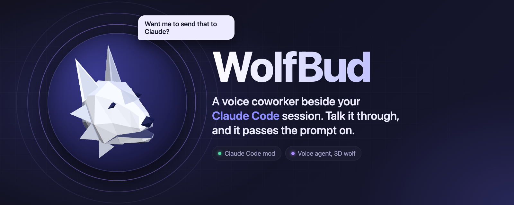
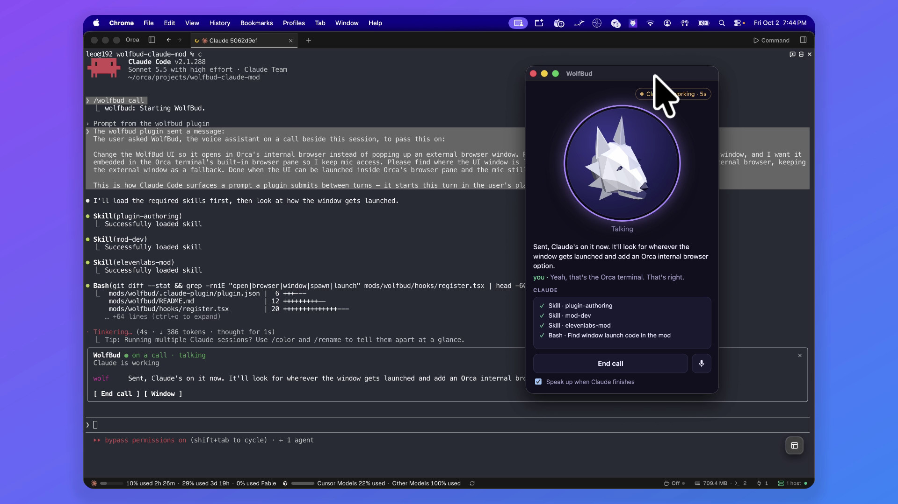
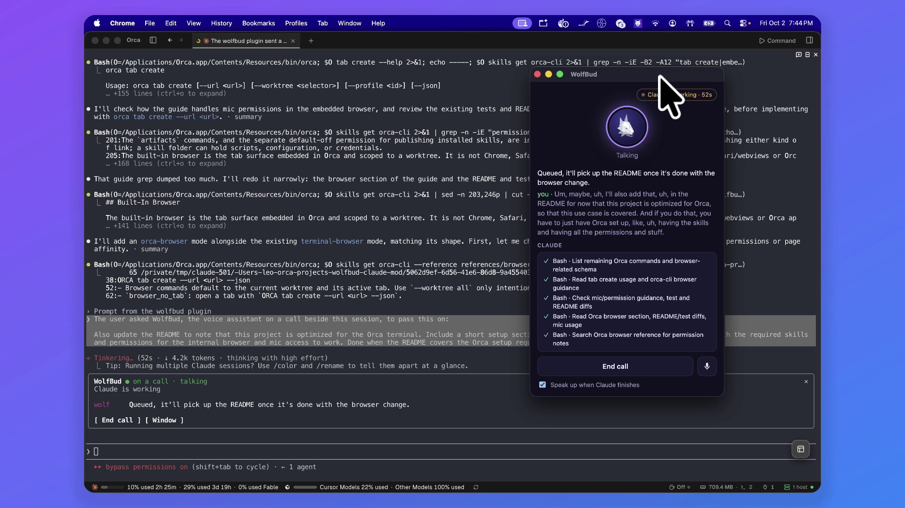
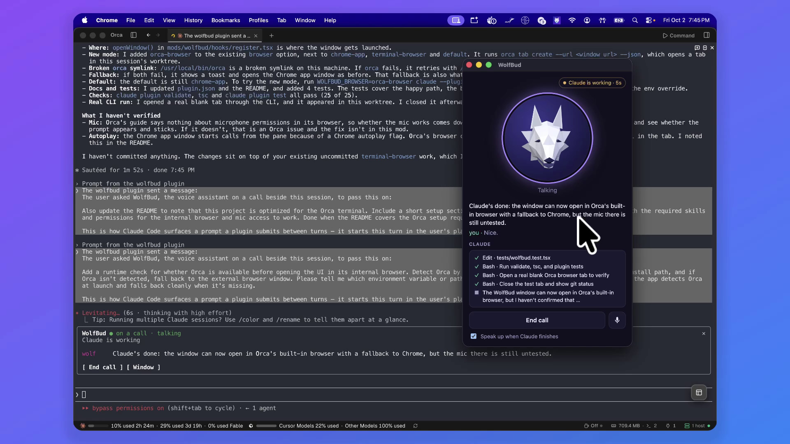
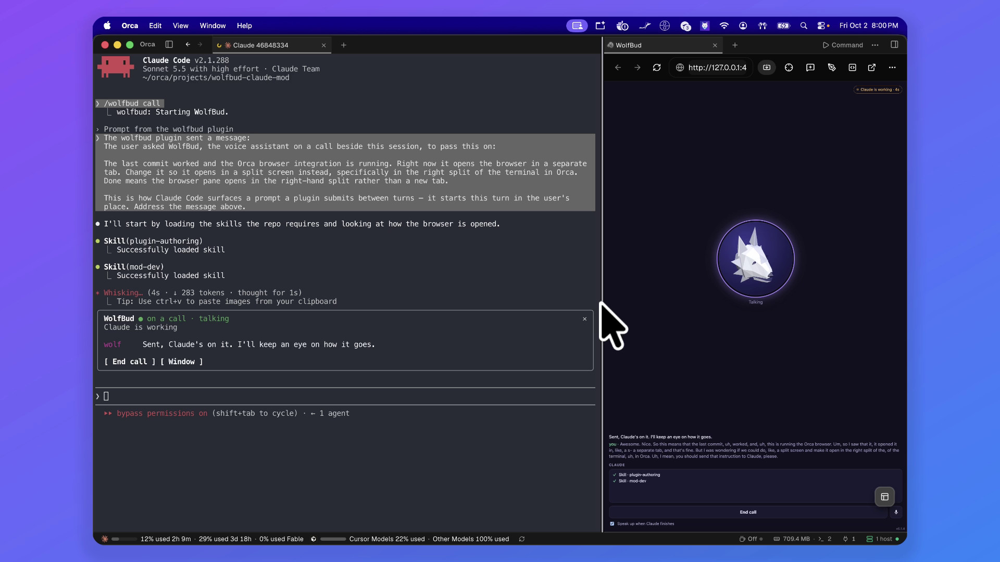
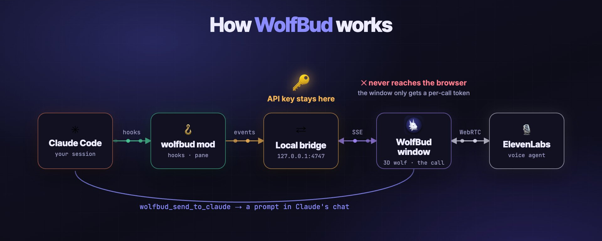
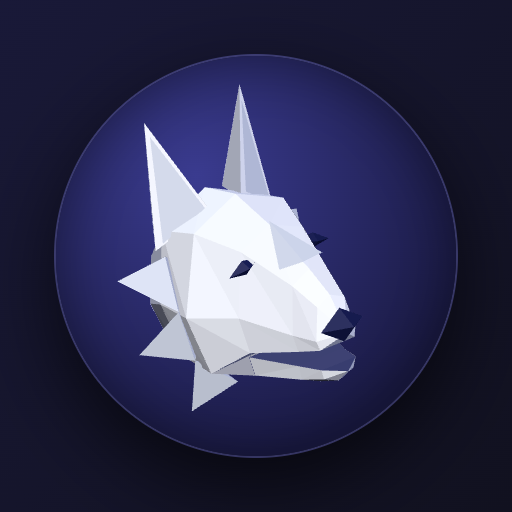

<p align="center">
  
</p>

<p align="center">
  
  
  
  
  
</p>

<p align="center">
  <b>WolfBud</b> is a voice coworker that sits beside your Claude Code session.<br>
  You talk things through with it. When you agree on something, it sends the prompt to Claude for you.
</p>

> [!NOTE]
> **Not affiliated with ElevenLabs.** This is an independent, unofficial project. It just calls the public [ElevenLabs API](https://elevenlabs.io/docs) with your own API key. "ElevenLabs" and its logo belong to ElevenLabs.

## See it in action

In this real 20-minute session, I ask for every change out loud and WolfBud writes the prompts. Claude adds [Orca](https://orca.build) support to WolfBud itself and pushes three commits.

https://github.com/user-attachments/assets/6aff10b8-b493-4e9a-a19d-4d3a5bb5b8f2

<table>
  <tr>
    <td width="50%"></td>
    <td width="50%"></td>
  </tr>
  <tr>
    <td><b>You talk, it sends.</b> If something is unclear it asks first, then it writes the prompt and hands it to Claude.</td>
    <td><b>Keep talking while Claude works.</b> New requests are queued for when Claude is done.</td>
  </tr>
  <tr>
    <td width="50%"></td>
    <td width="50%"></td>
  </tr>
  <tr>
    <td><b>It speaks up when Claude is done</b>, with what changed and what is still untested.</td>
    <td><b>Inside Orca.</b> The last call of the session ran in Orca's built-in browser, the feature it had just built.</td>
  </tr>
</table>

There are two more cuts of the same session: [How it works](https://github.com/user-attachments/assets/66cf45d0-0f06-4ee9-87f0-56d41ac6dc14), in which WolfBud narrates itself over diagrams, and a [vertical teaser](https://github.com/user-attachments/assets/3dc689e3-4f31-45cc-b184-cf4202280467). They were made with Remotion, with music, effects and narration by ElevenLabs.

## What it does

- **Watches the session.** Your prompts, Claude's tool calls, failures, final answers and permission prompts all reach the agent as context.
- **Talks with you.** A call with an ElevenLabs conversational agent, shown as a 3D wolf whose jaw follows its voice and whose head turns to look at your pointer.
- **Sends prompts to Claude.** When you decide something together, `wolfbud_send_to_claude` starts a turn, adds a note to the running one, or queues it for when Claude is done.
- **Speaks up when Claude finishes** or is waiting on a permission, after a pause so it doesn't talk over you.
- **Stops Claude** if you ask it to.

<p align="center">
  
</p>

The mod itself is in [`mods/wolfbud`](mods/wolfbud); its [README](mods/wolfbud/README.md) has the full architecture, commands and options.

> **Optimized for [Orca](https://orca.build).** Run Claude Code in an Orca terminal and WolfBud opens its window as a tab in Orca's built-in browser (the default `browser: auto` picks it inside Orca). Orca needs mic access allowed; see [In Orca](mods/wolfbud/README.md#in-orca-orca-browser) for the setup. Outside Orca, or if that fails, it opens a Chrome app window.

## Quick start

You need Claude Code ≥ 2.1.287, Node 20+, Google Chrome (macOS tested) and an [ElevenLabs API key](https://elevenlabs.io/app/settings/api-keys). It installs straight from GitHub, with no clone and no build:

```bash
claude plugin marketplace add leopiney/wolfbud-claude-mod
claude plugin install wolfbud@elevenlabs-mods
```

Inside Claude Code, `/plugin install wolfbud --marketplace leopiney/wolfbud-claude-mod` does both in one step.

Then give it your API key: export `ELEVENLABS_API_KEY` before you start Claude Code, or save the key in Claude Code's secure storage with `/plugin configure wolfbud@elevenlabs-mods`, or from your shell:

```bash
printf '{"api_key":"%s"}' "$ELEVENLABS_API_KEY" | claude plugin configure wolfbud@elevenlabs-mods --values-stdin
```

Restart Claude Code (or run `/reload-plugins`), then:

| | |
| --- | --- |
| `/wolfbud` | open the pane and the wolf window |
| `/wolfbud call` | open them and start the call |
| `/wolfbud end` | hang up |

The first time, WolfBud takes a few seconds to set up its voice agent in your ElevenLabs account. New versions come with `claude plugin update wolfbud@elevenlabs-mods`, and they update your agent the same way.

Working on WolfBud itself? Clone the repo and run `claude --plugin-dir ./mods/wolfbud` (it hot-reloads), or install your clone with `pnpm run install-plugin`. The [mod's README](mods/wolfbud/README.md#install) has the details.

## Your key, your agent

- The agent is created in **your** ElevenLabs account the first time you use WolfBud, and the calls are billed to it.
- The API key stays in the local bridge (127.0.0.1 only); it never reaches the browser window.
- The bridge checks a per-session key and rejects foreign `Host` and `Origin` headers, so a web page can't push prompts into Claude's chat.

## Repo layout

| Path | |
| --- | --- |
| [`mods/wolfbud`](mods/wolfbud) | the Claude Code mod: hooks, pane, local bridge (which also sets up the agent), agent definition, built window |
| [`window/`](window) | the call window: Vite + three.js wolf + `@elevenlabs/client` (WebRTC), built into the mod and committed |
| [`scripts/`](scripts) | `agent:sync` (push the agent definition by hand), `agent:simulate` (a call without a mic) and `install-plugin` (install from a clone) |
| [`assets/`](assets) | the banner, icon and screenshots above, and the demo videos (in Git LFS) |

## Related

**[leopiney/wolfbud](https://github.com/leopiney/wolfbud)**: the desktop app this wolf comes from. Text-to-speech and speech-to-text with the ElevenLabs **Scribe v2** model, and really nice. This repo brings the same wolf into Claude Code as a voice coworker.

<p align="center">
  
</p>
